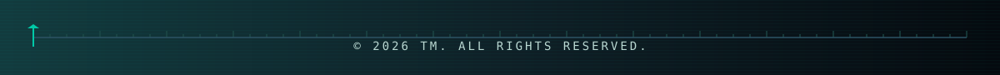

<div align="center">


<a href="https://unischool-tm.github.io/portfolio/">
  
</a>


<br/>


[](https://unischool-tm.github.io/portfolio/)
[](https://unischool.jp/)
[](https://www.instagram.com/unischool_tm/)
[](mailto:ebinotenmusu@gmail.com)


</div>


<br/>


<table>
<tr>
<td width="60%" valign="top">


### `>_` About


始まりは、中学生のときに書いていた恐竜好きが高じたブログ。WordPressで一から組み立て、書くこと・伝えることの土台をつくった。


そこからSNSでの発信に領域を広げ、次第に映像へ。今では**企画から撮影・編集まで**を一人でこなすクリエイターとして活動中。


「学生だからできない」ではなく **「学生だからこそできる」** を体現するプロジェクトに携わっている。


```txt
JHS   恐竜ブログを開設 (WordPress)
JHS   SNS運用をスタート
JHS〜 YouTube・映像編集を開始
NOW   高校1年生。UniSchool で活動中
```


</td>
<td width="40%" valign="top">


### `>_` Organization


**UniSchool** — リーダー / 動画編集担当


中・高校生が立ち上げた、学生の学びと学校を支える事業グループ。教育とクリエイティブを通して、すべての学生が挑戦しやすい未来へ。


[→ unischool.jp](https://unischool.jp/)


</td>
</tr>
</table>


<br/>


### `>_` Track Record


<table>
<tr>
<td width="33%" valign="top">


**🎵 Suno AI × LoFi**


Suno AIで制作したLoFi音楽をYouTubeで展開。企画・音源制作・映像編集までを一貫して担当し、チャンネルの**収益化を達成**。


</td>
<td width="33%" valign="top">


**📱 案件受注**


YouTube・Instagramの制作案件を受注。アカウント運用ではなく、動画・コンテンツ制作を担当。


</td>
<td width="33%" valign="top">


**🎬 劇場CM放映**


三田学園の広報PR映像を制作。劇場版名探偵コナンの上映前CMとして映画館で放映された。


</td>
</tr>
</table>


<br/>


<div align="center">


### `>_` Tools


</div>


<br/>


<div align="center">


映像制作・SNS案件のご相談はこちらから


[](https://unischool-tm.github.io/portfolio/)


<br/>





</div>
